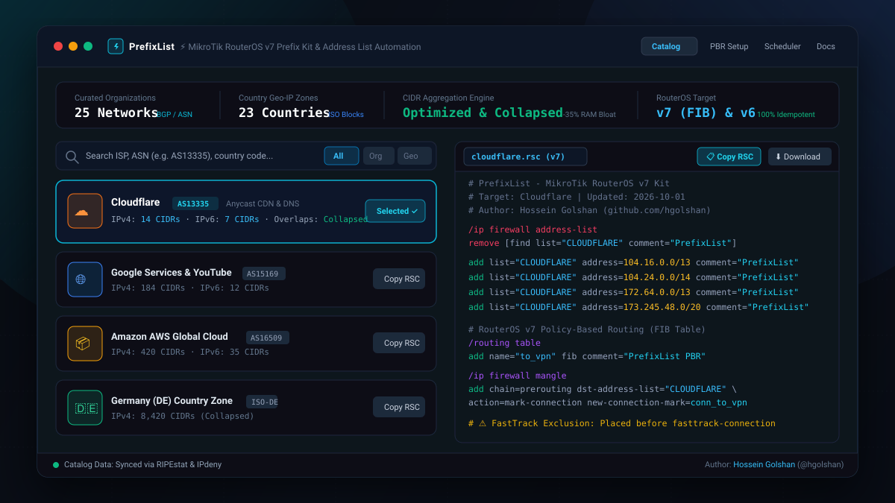

<div align="center">


# PrefixList ⚡ MikroTik RouterOS v7 Prefix Kit

**A high-performance, public MikroTik RouterOS v7 prefix kit and web builder.**  
*Automatically generate and maintain optimized, idempotent firewall address lists, ASN blocks, and country zones for weekly automated updates.*

[](LICENSE)
[](https://github.com/hgolshan/MikroTik-RouterOS-v7-Address-Lists-Prefix-Kit/actions)
[](https://github.com/hgolshan/MikroTik-RouterOS-v7-Address-Lists-Prefix-Kit/actions)
[](https://mikrotik.com)
[](https://hgolshan.github.io/MikroTik-RouterOS-v7-Address-Lists-Prefix-Kit/)
[](https://github.com/hgolshan)

<br />

[](https://hgolshan.github.io/MikroTik-RouterOS-v7-Address-Lists-Prefix-Kit/)

**[🌐 Interactive Web Builder](https://hgolshan.github.io/MikroTik-RouterOS-v7-Address-Lists-Prefix-Kit/)** · **[📦 Raw GitHub Lists](https://raw.githubusercontent.com/hgolshan/MikroTik-RouterOS-v7-Address-Lists-Prefix-Kit/main/public/lists/)** · **[📑 Full JSON Catalog](https://raw.githubusercontent.com/hgolshan/MikroTik-RouterOS-v7-Address-Lists-Prefix-Kit/main/public/lists/index.json)**

</div>

---

## 📖 Overview

**PrefixList** is an open-source, production-grade prefix kit and address list automation toolkit engineered specifically for MikroTik network administrators and routing engineers.

Managing large collections of IP ranges on edge routers typically leads to two critical operational issues:
1. **Firewall Bloat & Memory Leaks**: Routers ingest thousands of fragmented subnets, exhausting RAM and spiking CPU during packet matching.
2. **Brittle Update Scripts**: Standard scripts execute `/ip firewall address-list remove [find list=X]` *before* downloading new data. If the internet drops or an external server returns HTTP 500 mid-fetch, the entire address list vanishes, taking down failover routes and firewall security rules.

### Why Network Engineers Use PrefixList:
- **CIDR Overlap Collapsing**: Adjacent and nested subnets (e.g., `104.16.0.0/14` and `104.20.0.0/14`) are dynamically calculated into optimal, minimal power-of-2 CIDR prefixes, shrinking table sizes by 20% to 45%.
- **Guaranteed Idempotency**: Each generated command uses scoped metadata (`comment="PrefixList"`). Running the script repeatedly safely replaces stale entries without modifying custom manual subnets or creating duplicate entries.
- **MicroTik RouterOS v7 Native**: Ready-to-apply Policy-Based Routing (PBR) using ROS7 `/routing table add name=... fib` syntax and mangle connection marking.
- **Fail-Safe Weekly Auto-Updater**: Uses a 3-step staged transaction model (`fetch` → `size validation` → `atomic import`) that guarantees existing firewall rules are never dropped on network failure.
- **Zero Third-Party Runtime Dependencies**: All prebuilt lists are hosted directly on GitHub Pages and GitHub Raw with permanent, predictable URL paths.

---

## ⚡ Quick Start: Ready-Made Lists & Tool Fetch

Import pre-aggregated, ready-to-use `.rsc` files directly into your MikroTik terminal via `/tool fetch`.

### 1. Popular ISP & Organization Prefix Blocks
```routeros
# Cloudflare (Anycast & CDN)
/tool fetch url="https://raw.githubusercontent.com/hgolshan/MikroTik-RouterOS-v7-Address-Lists-Prefix-Kit/main/public/lists/org/cloudflare.rsc" dst-path="cloudflare.rsc"
/import cloudflare.rsc
/file remove [find name="cloudflare.rsc"]

# Google & YouTube Services
/tool fetch url="https://raw.githubusercontent.com/hgolshan/MikroTik-RouterOS-v7-Address-Lists-Prefix-Kit/main/public/lists/org/google.rsc" dst-path="google.rsc"
/import google.rsc
/file remove [find name="google.rsc"]

# Amazon AWS Cloud
/tool fetch url="https://raw.githubusercontent.com/hgolshan/MikroTik-RouterOS-v7-Address-Lists-Prefix-Kit/main/public/lists/org/amazon.rsc" dst-path="amazon.rsc"
/import amazon.rsc
/file remove [find name="amazon.rsc"]

# Microsoft Azure & 365
/tool fetch url="https://raw.githubusercontent.com/hgolshan/MikroTik-RouterOS-v7-Address-Lists-Prefix-Kit/main/public/lists/org/microsoft.rsc" dst-path="microsoft.rsc"
/import microsoft.rsc
/file remove [find name="microsoft.rsc"]

# Meta (Facebook, Instagram, WhatsApp)
/tool fetch url="https://raw.githubusercontent.com/hgolshan/MikroTik-RouterOS-v7-Address-Lists-Prefix-Kit/main/public/lists/org/meta.rsc" dst-path="meta.rsc"
/import meta.rsc
/file remove [find name="meta.rsc"]

# Telegram Data Centers
/tool fetch url="https://raw.githubusercontent.com/hgolshan/MikroTik-RouterOS-v7-Address-Lists-Prefix-Kit/main/public/lists/org/telegram.rsc" dst-path="telegram.rsc"
/import telegram.rsc
/file remove [find name="telegram.rsc"]
```

### 2. Country Geo-IP Zones
```routeros
# Germany (DE)
/tool fetch url="https://raw.githubusercontent.com/hgolshan/MikroTik-RouterOS-v7-Address-Lists-Prefix-Kit/main/public/lists/countries/de.rsc" dst-path="de.rsc"
/import de.rsc
/file remove [find name="de.rsc"]

# United States (US)
/tool fetch url="https://raw.githubusercontent.com/hgolshan/MikroTik-RouterOS-v7-Address-Lists-Prefix-Kit/main/public/lists/countries/us.rsc" dst-path="us.rsc"
/import us.rsc
/file remove [find name="us.rsc"]

# United Kingdom (GB)
/tool fetch url="https://raw.githubusercontent.com/hgolshan/MikroTik-RouterOS-v7-Address-Lists-Prefix-Kit/main/public/lists/countries/gb.rsc" dst-path="gb.rsc"
/import gb.rsc
/file remove [find name="gb.rsc"]

# Iran (IR)
/tool fetch url="https://raw.githubusercontent.com/hgolshan/MikroTik-RouterOS-v7-Address-Lists-Prefix-Kit/main/public/lists/countries/ir.rsc" dst-path="ir.rsc"
/import ir.rsc
/file remove [find name="ir.rsc"]
```

*Browse the full catalog of organizations, CDNs, hosting providers, and ISO countries at [https://hgolshan.github.io/MikroTik-RouterOS-v7-Address-Lists-Prefix-Kit/](https://hgolshan.github.io/MikroTik-RouterOS-v7-Address-Lists-Prefix-Kit/).*

---

## 🔄 Automated Weekly Updates via `/system scheduler`

To keep your router's firewall address lists updated without manual intervention, configure this fail-safe auto-updater script. 

### Why Standard Fetch Scripts Break:
Most tutorial scripts execute:
```routeros
# ❌ DANGEROUS: If network drops during fetch, the list remains completely wiped!
/ip firewall address-list remove [find list="CLOUDFLARE"]
/tool fetch url="..." dst-path="cf.rsc"
/import cf.rsc
```

### The PrefixList Safe Transaction Architecture:
PrefixList uses a 3-phase execution model:
1. **Isolated Download**: Fetches to a temporary file (`pl_tmp_NAME.rsc`). The live address list remains completely untouched.
2. **File Integrity Verification**: Verifies the file was received and is larger than 80 bytes.
3. **Atomic Replacement & Purge**: Calls `/import` inside an error boundary, then cleans up temporary storage. If the fetch fails, existing rules are preserved and an alert is recorded in `:log warning`.

### Copy-Paste MikroTik Script & Scheduler:
Paste this into your RouterOS Terminal (replace `CLOUDFLARE` with your desired list name and URL):

```routeros
/system script
add name="update-prefixlist-CLOUDFLARE" dont-require-permissions=no source="\
:local listName \"CLOUDFLARE\";\
:local fetchUrl \"https://raw.githubusercontent.com/hgolshan/MikroTik-RouterOS-v7-Address-Lists-Prefix-Kit/main/public/lists/org/cloudflare.rsc\";\
:local tempFile \"pl_tmp_CLOUDFLARE.rsc\";\
:local logTag \"PrefixList-Updater [CLOUDFLARE]:\";\
:log info (\"$logTag Initiating secure fetch from \" . \$fetchUrl);\
:do {\
  /tool fetch url=\$fetchUrl dst-path=\$tempFile mode=https keep-result=yes;\
} on-error={\
  :log warning (\"$logTag Fetch failed! Network unreachable. Preserving current firewall entries.\");\
  :error \"Fetch failed\";\
};\
:delay 2s;\
:local fItem [/file find name=\$tempFile];\
:if ([:len \$fItem] > 0) do={\
  :local fSize [/file get \$fItem size];\
  :if (\$fSize > 80) do={\
    :log info (\"$logTag Verified non-empty file (\" . \$fSize . \" bytes). Importing...\");\
    :do {\
      /import file-name=\$tempFile;\
      :log info (\"$logTag Address-list updated successfully!\");\
    } on-error={\
      :log error (\"$logTag Import syntax error! Preserving existing firewall state.\");\
    };\
  } else={\
    :log warning (\"$logTag Downloaded file is truncated (\" . \$fSize . \" bytes). Aborting import.\");\
  };\
  /file remove \$fItem;\
} else={\
  :log warning (\"$logTag Temp file not found on disk. Aborting.\");\
};\
"

# Schedule weekly sync every Sunday at 03:30 AM
/system scheduler
add name="sched-update-prefixlist-CLOUDFLARE" start-time=03:30:00 interval=7d on-event="update-prefixlist-CLOUDFLARE" comment="PrefixList Weekly Sync"
```

---

## 🔀 RouterOS v7 Policy Routing & FastTrack Guide

RouterOS v7 fundamentally changed Policy-Based Routing (PBR): routing marks are now bound to dedicated routing tables configured with the `fib` (Forwarding Information Base) property.

### Complete RouterOS v7 Configuration Recipe

```routeros
# =====================================================================
# Policy-Based Routing (PBR) for RouterOS v7
# Target List: CLOUDFLARE -> Forwarded to: wireguard1
# =====================================================================

# 1. Create a dedicated routing table with FIB enabled
/routing table
add name="to_vpn" fib comment="PrefixList PBR Table for CLOUDFLARE"

# 2. Add default route into the dedicated routing table
/ip route
add dst-address=0.0.0.0/0 gateway=wireguard1 routing-table="to_vpn" check-gateway=ping distance=1 comment="PrefixList PBR Default Route"

# 3. Connection Tracking & Mangle Marking (Prerouting)
/ip firewall mangle
# 3a. Mark new connection destined for the target address list
add chain=prerouting in-interface-list=LAN dst-address-list="CLOUDFLARE" connection-state=new action=mark-connection new-connection-mark=conn_to_vpn passthrough=yes comment="PrefixList PBR [CLOUDFLARE]"

# 3b. Mark routing for marked connection
add chain=prerouting in-interface-list=LAN connection-mark=conn_to_vpn action=mark-routing new-routing-mark="to_vpn" passthrough=no comment="PrefixList PBR [CLOUDFLARE]"

# =====================================================================
# ⚠️ CRITICAL: FastTrack Firewall Exclusion
# =====================================================================
# RouterOS FastTrack bypasses the Mangle facility for established packets.
# Without an exclusion rule, only the initial SYN packet is routed via 'to_vpn',
# resulting in stalled or asymmetric connections.
# This rule accepts established PBR connections BEFORE the FastTrack rule:
/ip firewall filter
add chain=forward action=accept connection-state=established,related connection-mark=conn_to_vpn place-before=[find action=fasttrack-connection] comment="PrefixList FastTrack Bypass [CLOUDFLARE]"
```

---

## ⚙️ GitHub Actions Network Automation Pipeline

All prebuilt files in `public/lists/` are automatically refreshed every Sunday at `02:00 UTC` through GitHub Actions ([`.github/workflows/update-lists.yml`](.github/workflows/update-lists.yml)):

```
┌─────────────────┐     ┌──────────────────────┐     ┌─────────────────────┐     ┌──────────────────┐
│  Weekly Cron    │────▶│  Query BGP & RIPE    │────▶│  CIDR Aggregation   │────▶│  Deploy to Raw   │
│  (Sunday 02:00) │     │  Prefix Data Feeds   │     │  & Overlap Collapse │     │  & GitHub Pages  │
└─────────────────┘     └──────────────────────┘     └─────────────────────┘     └──────────────────┘
```

1. **Scheduled Trigger**: Dispatches `scripts/build-prebuilt-lists.ts` on Node.js 20.
2. **Fail-Safe BGP Querying**: Ingests prefix announcements via RIPEstat API and regional registries. If any external endpoint is unreachable or returns zero prefixes, existing files are preserved.
3. **CIDR Normalization**: Subnets are converted to 32-bit integer ranges, sorted, coalesced across overlaps, and emitted as minimal CIDR notations.
4. **Autonomous Git Deployment**: Changes are committed by `github-actions[bot]` and published to the `main` branch and GitHub Pages.

---

## 🌐 Data Sources & Attribution

PrefixList is built upon authoritative open data feeds from global internet routing registries:

- **[RIPE NCC RIPEstat Data API](https://stat.ripe.net/)**: Real-time BGP routing status, announced prefix lists, and autonomous system numbers (ASNs).
- **[IPdeny](https://www.ipdeny.com/)**: Aggregated country-level IP CIDR blocks and regional internet registry (RIR) allocations (ARIN, RIPE, APNIC, LACNIC, AFRINIC).
- **[MikroTik RouterOS Documentation](https://help.mikrotik.com/docs/)**: Official guidelines for RouterOS v7 routing architecture, `/routing table` FIB configuration, and `/tool fetch`.

---

## 👨‍💻 Author

**Hossein Golshan**  
*Network Engineer & Open-Source Developer*

- GitHub: [@hgolshan](https://github.com/hgolshan)
- Project Repository: [https://github.com/hgolshan/prefixlist](https://github.com/hgolshan/prefixlist)
- Web Application: [https://hgolshan.github.io/prefixlist/](https://hgolshan.github.io/prefixlist/)
- Email: [h.golshan128@gmail.com](mailto:h.golshan128@gmail.com)

---

## 📄 License

This project is open-source software licensed under the **[MIT License](LICENSE)**. You are free to use, modify, and distribute it for personal and commercial MikroTik deployments.
